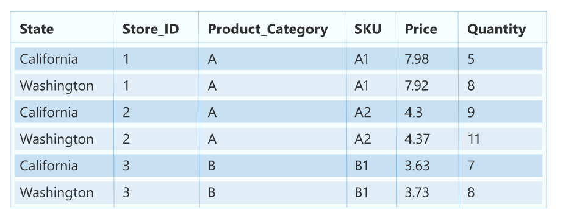
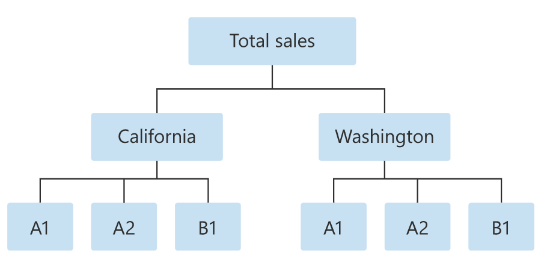
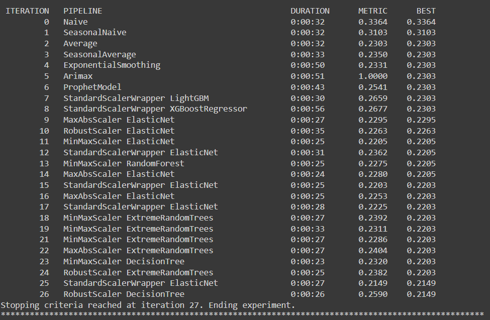

# Azure AutoML Hierarchical Time Series Forecasting

## Hierarchical Time Series Forecasting<br>

This type of forecasting is used when there are multiple variable categories forming an hierarchy.

The Data under consideration is as follows:<br>


Hierarchy Order for the Data is as follows: <br>


We will be predicting the Quantity for this combination of Data on daily basis for a time period of 30 days

```
state=WA,store_id=1,product_category=B, SKU=B2
```

The Dataset used for training is named as :
hts-sample-train.csv

The Dataset used for testing is named as :
hts-sample-test.csv

## Problem with conventional Hierarchical Time Series Forecasting :

Using a standard compute resource (STANDARD_DS11_V2) and training the model over the dataset provided in the Data folder took more than 3 hours to train the model. As per the [documentation](https://docs.microsoft.com/en-us/azure/machine-learning/how-to-auto-train-forecast), I assume that the model is trained on all hierarchy combinations at once.<br><br>

The issue is that I wanted forecasts for a very niche set of query, i.e. state=WA,store_id=1,product_category=B, SKU=B2, but I had to wait for the whole traning to get over hence I have come up with this class-based solution to address this issue by natively using Azure Automl <br><br>

## Solution Proposal<br>

I dynamically slice the dataset based on the hierarchy variables the user passes for which it requires the forecast for, then using the sliced dataset, I train the model and generate forecasts for the same. There is an additional caching feature to avoid retraining models on the same hierarchy variables.

This is beneficial in 2 ways:<br>

- We can work with the standard compute resource and don't need to acquire more expensive compute resources
- Traning time reduced significantly, as we train only on what's needed at this point.

## Evaluation Metrics<br>

I have used normalized_root_mean_squared_error metric for evaluation.<br>
Natively Azure Automl tries to fit different forecasting models and evaulates them on the specified metric.(in this case normalized_root_mean_squared_error)

The forecasting model with the least error is then chosen for the prediction job


